# 💻 Linux Server Domain Controller

## Setup: Samba 4 AD/DC Implementation

This project outlines the comprehensive steps to transform a standard Linux server into a robust Primary Domain Controller (PDC) using Samba 4. This solution provides an open-source, cost-effective alternative to proprietary Active Directory services, offering centralized user authentication, group policy management, and DNS resolution for heterogeneous networks including Windows, Linux, and macOS clients.

This will be my personal server configurations change as needed:

Linux Server:

Password: admin_21
Internal network IP: 192.168.6.1
Bridge IP: 172.30.20.46/25 (enp0s3)
DHCP server: 192.168.6.2
DHCP range: 192.168.70.106-126
DNS: 192.168.6.1
NetBIOS: LS06 | lab06.lan
Domain: lab06.lan
FQDN: LS06.lab06.lan


---

## Features

- **Centralized Authentication**: Manage user accounts and authenticate clients against the Samba 4 AD/DC.
- **Group Policy Management**: Implement and enforce network-wide policies for enhanced security and configuration consistency.
- **Integrated DNS**: Samba 4 integrates seamlessly with BIND for robust DNS services within the domain.
- **Flexible Client Support**: Join Windows, Linux, and macOS clients to the domain.
- **Open Source Solution**: Leverage the power and flexibility of open-source software for enterprise-grade domain services.

---

## Getting Started

These instructions will get you a copy of the project up and running on your local machine for development and testing purposes.

### Prerequisites

To replicate this project, you will need the following:

- A virtual machine or physical server with a minimum of **2GB RAM** and **2 CPU cores**.
- A clean installation of **Ubuntu Server 24.04 LTS** (or a similar Debian/RPM-based distribution).
- A separate client machine to test the domain join process.

---

## Sprints

**Sprint 1:**

- [1.1. Server Preparation](#11-server-preparation)
- [1.2. Installation of Samba and Kerberos](#12-installation-of-samba-and-kerberos)
- [1.2.1. Configure Samba](#121-configure-samba)
- [1.3. Restart Services](#13-restart-services)

**Sprint 2:**

- [2.1. Join Windows client](#21-join-windows-to-the-domain)
- [2.2. Join Linux client](#22-join-linux-to-the-domain)

**Sprint 3:**

- [3.1. Shared Folders](#31-shared-folders)
- [3.2. Create Domain Users](#32-create-domain-users)
- [3.3. Manage Policies (GPOs/PSOs)](#33-manage-policies-gpospos)
  - [3.3.1. Minimum 8-character passwords](#331-minimum-8-character-passwords)
  - [3.3.2. 5-minute lockout after 3 failed attempts](#332-5-minute-lockout-after-3-failed-attempts)
- [3.4. Scheduled Tasks (crontab)](#34-scheduled-tasks-crontab)
- [3.5. Disk Management (fstab)](#35-disk-management-fstab)
- [3.6. Process Management](#36-process-management)

**Sprint 4:**

- [4.1. Create trust relationships between domains (with peer)](#41-create-trust-relationships-between)

**Sprint 5:**

- [5.1. Create a DC/AD in AWS](#51-create-a-dcad-in-aws)
- [5.2. Create a shared folder and an AD user](#52-create-a-shared-folder-and-an-ad-user)
- [5.3. Launch a Windows Client in AWS](#53-launch-a-windows-client-in-aws)
- [5.4. Access the AWS Shared Folder from Local Linux](#54-access-the-aws-shared-folder-from-local-linux)

---

## Sprint 1: Installation (Samba and Kerberos) and Initial Configuration

Follow these steps to set up your Linux server as a Samba 4 Domain Controller.

### 1.1. Server Preparation

First, ensure your server is up-to-date correctly.

```bash
# Upgrade to new system version
sudo apt update

# Update the Linux version if needed (will restart)
# yes | sudo do-release-upgrade
sudo apt update && sudo apt upgrade -y

# Install necessary tools
sudo apt install -y vim net-tools ntp
```

Now correctly configure it with a hostname and static IP address.

```bash
# Set hostname
sudo hostnamectl set-hostname LS06.lab06.lan

# Edit /etc/hosts to include your static IP and FQDN
echo "192.168.6.1    LS06.lab06.lan    LS06" | sudo tee /etc/hosts
```

Edit netplan and set a static IP address:

```bash
sudo nano /etc/netplan/50-cloud-init.yaml
```

```yaml
network:
  version: 2
  ethernets:
    enp0s3:
      dhcp4: no
      addresses:
        - 172.30.20.46/25
      gateway4: 172.30.20.1
      nameservers:
        addresses:
          - 10.239.3.7
          - 10.239.3.8
          - 8.8.8.8
    enp0s8:
      dhcp4: no
      addresses:
        - 192.168.6.1/24
      gateway4: 192.168.6.1
      nameservers:
        addresses:
          - 127.0.0.1
```

```bash
# Apply changes
sudo netplan apply
```

### 1.2. Installation of Samba and Kerberos

Now install Samba and Kerberos:

```bash
sudo apt install -y samba krb5-config winbind
```

During the installation of krb5-config you will be prompted for Kerberos configuration:

- **Default Kerberos Realm:** LAB06.LAN

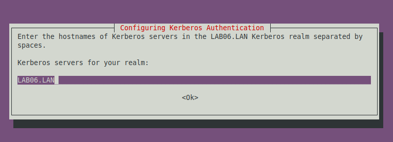

- **Kerberos servers for your realm:** LS06.lab06.lan
- **Administrative server for your Kerberos realm:** LS06.lab06.lan

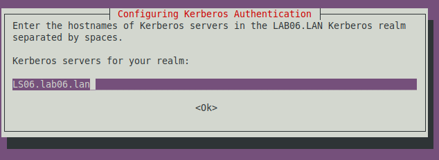

### 1.2.1 Configure Samba

Before provisioning, move or remove the default smb.conf file.

```bash
sudo mv /etc/samba/smb.conf /etc/samba/smb.conf.bkp

# Now, provision the domain (realm in uppercase)
sudo samba-tool domain provision --use-rfc2307 --interactive
```

Provisioning answers:

```txt
realm         = LAB06.LAN
domain        = LAB06
server-role   = dc
dns-backend   = SAMBA_INTERNAL
dns-forwarder = 192.168.6.1
adminpass     = Admin_21
```

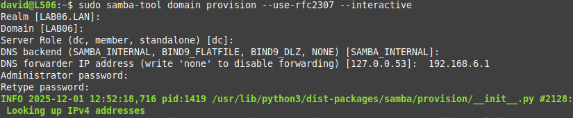

Now update the DNS resolver:

```bash
sudo bash -c 'echo "nameserver 127.0.0.1
nameserver 192.168.6.1" > /etc/resolv.conf'
```

### 1.3. Restart Services

```bash
# Stop and disable non-DC services (if they are running)
sudo systemctl stop smbd nmbd winbind
sudo systemctl disable smbd nmbd winbind

# Enable and start the Active Directory DC service
sudo systemctl unmask samba-ad-dc
sudo systemctl enable samba-ad-dc
sudo systemctl start samba-ad-dc
```

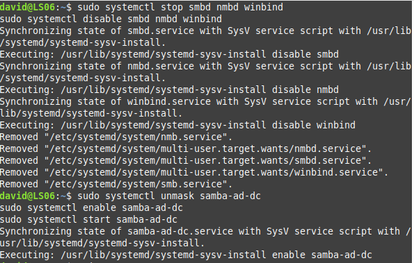

Verify the domain is running correctly:

```bash
sudo samba-tool domain info 127.0.0.1
sudo samba-tool user list
```

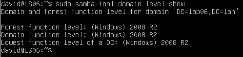

---

## Sprint 2: Join Clients to the Domain (Windows and Linux)

### 2.1. Join Windows to the Domain

First we start with the base that we have a Windows client already installed.

#### 2.1.1. Configure Network Settings

Settings → Network & Internet → Ethernet/Wi-Fi → Edit → Manual

Configure:
- **IP address:** 192.168.6.20
- **Subnet mask:** 255.255.255.0
- **Gateway:** 192.168.6.1 (optional)
- **Primary DNS:** 192.168.6.1
- **Secondary DNS:** 10.239.3.7

After setting up the network configuration check connectivity with the server:

```powershell
ping 192.168.6.1
nslookup lab06.lan
nslookup ls06.lab06.lan
```

#### 2.1.2. Join Domain

- 1 Navigate to **Settings**.

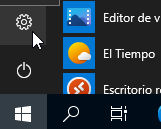

- 2 Click on the **System** option.

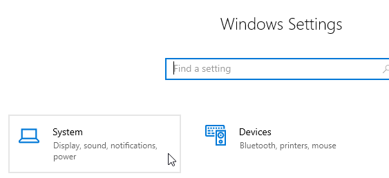

- 3 Select **About** from the left sidebar.

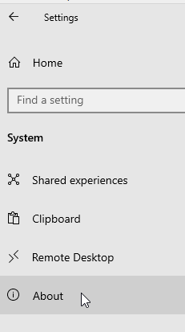

- 4 Look for **Related settings**.

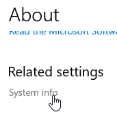

- 5 Click on **Change settings**.

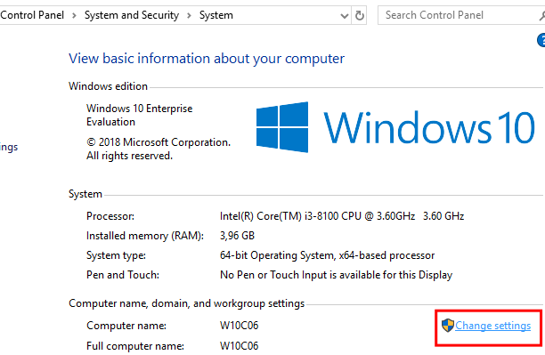

- 6 Select **Change** to proceed.

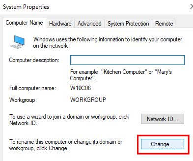

- 7 Click **Domain or workgroup**
- 8 Click **Domain**
- 9 Type: `lab06.lan`
- 10 Click **OK**
- 11 Enter credentials:
  - **Username:** Administrator
  - **Password:** Admin_21
- 12 Click **OK**

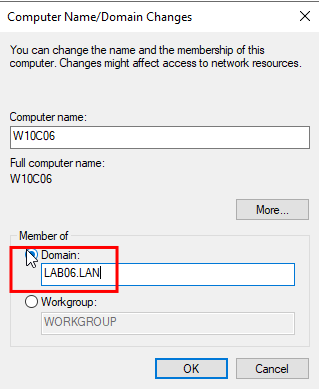

The client has now joined the domain.

#### 2.1.3. Verify Domain Join

```powershell
nltest /dclist:lab06.lan
```

#### 2.1.4. Access Shared Folders

**From File Explorer**, type in the address bar:

```
\\ls06.lab06.lan
```

Available shares:
- FinanceDocs
- HRDocs
- Public

**Map a network drive:**

- 1 Right-click **This PC** → **Map network drive**
- 2 Choose a drive letter (e.g. Z:)
- 3 Enter path: `\\ls06.lab06.lan\Public`
- 4 Check **Reconnect at sign-in**
- 5 Click **Finish**

---

### 2.2. Join Linux to the Domain

First we start with the base that we have a Linux client already installed.

#### 2.2.1. Configure Network Settings

```bash
sudo nano /etc/netplan/50-cloud-init.yaml
```

```yaml
network:
  version: 2
  ethernets:
    enp0s3:
      dhcp4: no
      addresses:
        - 192.168.6.21/24
      nameservers:
        addresses: [192.168.6.1]
        search: [lab06.lan]
```

```bash
sudo netplan apply
```

Verify connectivity with the server:

```bash
ping 192.168.6.1
nslookup lab06.lan
nslookup ls06.lab06.lan
```

#### 2.2.2. Install Required Packages

```bash
sudo apt update
sudo apt install -y samba-common-bin krb5-user
```

Kerberos configuration settings:
- **Default Kerberos realm:** LAB06.LAN
- **Kerberos servers:** ls06.lab06.lan
- **Administrative server:** ls06.lab06.lan

#### 2.2.3. Discover Domain

```bash
sudo realm discover lab06.lan
```

Expected output:
```
lab06.lan
  type: kerberos
  realm-name: LAB06.LAN
  domain-name: lab06.lan
  configured: no
  server-software: active-directory
  client-software: sssd
```

#### 2.2.4. Join Domain

```bash
sudo realm join --verbose --user=administrator lab06.lan
# Password: Admin_21
```

#### 2.2.5. Verify Domain Join

```bash
sudo realm list
```

Expected output:
```
lab06.lan
  type: kerberos
  realm-name: LAB06.LAN
  domain-name: lab06.lan
  configured: kerberos-member
  server-software: active-directory
  client-software: sssd
  login-formats: %U@lab06.lan
  login-policy: allow-realm-logins
```

Verify on the DC:

```bash
sudo samba-tool computer list
```

---

## Sprint 3: Create and Manage Users, GPOs/PSOs, Shared Folders, Scheduled Tasks and Disk Management

### 3.1. Shared Folders

Create the directory structure for shared folders and configure Samba shares.

```bash
# Create directory structure
sudo mkdir -p /srv/samba/{finance,hr,public}

# Set owners and base permissions
sudo chown -R root:"Domain Users" /srv/samba
sudo chmod -R 770 /srv/samba
```

Edit `/etc/samba/smb.conf` and add the share definitions after the `[netlogon]` section:

```ini
[FinanceDocs]
    comment = Finance Department Documents
    path = /srv/samba/finance
    valid users = @Finance, @"Domain Admins"
    read only = no
    browseable = yes
    create mask = 0660
    directory mask = 0770

[HRDocs]
    comment = HR Department Documents
    path = /srv/samba/hr
    valid users = @HR_Staff, @"Domain Admins"
    read only = no
    browseable = yes
    create mask = 0660
    directory mask = 0770

[Public]
    comment = Public Shared Documents (Read-Only)
    path = /srv/samba/public
    valid users = @"Domain Users"
    read only = yes
    browseable = yes
    write list = @"Domain Admins"
```

Verify the configuration and reload Samba:

```bash
testparm
sudo systemctl reload samba-ad-dc
```

Configure ACLs for each share:

```bash
# Install ACL tools
sudo apt install -y acl

# FinanceDocs: R/W with sticky bit (prevents other users from deleting files)
sudo setfacl -m g:Finance:rwx /srv/samba/finance
sudo setfacl -d -m g:Finance:rwx /srv/samba/finance
sudo chmod +t /srv/samba/finance

# HRDocs: Full R/W for HR_Staff
sudo setfacl -m g:HR_Staff:rwx /srv/samba/hr
sudo setfacl -d -m g:HR_Staff:rwx /srv/samba/hr

# Public: Read-only for all domain users
sudo setfacl -m g:"Domain Users":rx /srv/samba/public
sudo setfacl -d -m g:"Domain Users":rx /srv/samba/public
```

Verify ACLs:

```bash
for dir in finance hr public; do
    echo "=== /srv/samba/$dir ==="
    getfacl /srv/samba/$dir
    echo
done
```

---

### 3.2. Create Domain Users

Create Organizational Units and security groups, then add users.

```bash
# Create Organizational Units
sudo samba-tool ou create "OU=IT_Department,DC=lab06,DC=lan"
sudo samba-tool ou create "OU=HR_Department,DC=lab06,DC=lan"
sudo samba-tool ou create "OU=Students,DC=lab06,DC=lan"

# Verify OUs
sudo samba-tool ou list
```

```bash
# Create Security Groups
sudo samba-tool group add IT_Admins
sudo samba-tool group add HR_Staff
sudo samba-tool group add Students
sudo samba-tool group add Finance
```

```bash
# Create domain users
sudo samba-tool user create alice admin_21 --given-name=Alice --surname=Wonderland
sudo samba-tool user create bob admin_21 --given-name=Bob --surname=Marley
sudo samba-tool user create charlie admin_21 --given-name=Charlie --surname=Sheen

sudo samba-tool user create iosif admin_21 --given-name=Iosif --surname=Admin
sudo samba-tool user create karl admin_21 --given-name=Karl --surname=Admin

sudo samba-tool user create vladimir admin_21 --given-name=Vladimir --surname=HR

# Verify users
sudo samba-tool user list
```

```bash
# Assign users to groups
sudo samba-tool group addmembers Students alice,bob,charlie
sudo samba-tool group addmembers IT_Admins iosif,karl
sudo samba-tool group addmembers HR_Staff vladimir

# Verify memberships
sudo samba-tool group listmembers Students
sudo samba-tool group listmembers IT_Admins
sudo samba-tool group listmembers HR_Staff
```

---

### 3.3. Manage Policies (GPOs/PSOs)

#### 3.3.1. Minimum 8-character passwords

View current password policy and set minimum length:

```bash
sudo samba-tool domain passwordsettings show

sudo samba-tool domain passwordsettings set --min-pwd-length=8
sudo samba-tool domain passwordsettings set --complexity=on
sudo samba-tool domain passwordsettings set --history-length=24
sudo samba-tool domain passwordsettings set --min-pwd-age=1
sudo samba-tool domain passwordsettings set --max-pwd-age=42
```

Verify:

```bash
sudo samba-tool domain passwordsettings show
```

Expected output:

```
Password complexity: on
Minimum password length: 8
Password history length: 24
Minimum password age (days): 1
Maximum password age (days): 42
```

#### 3.3.2. 5-minute lockout after 3 failed attempts

```bash
sudo samba-tool domain passwordsettings set --account-lockout-threshold=3
sudo samba-tool domain passwordsettings set --account-lockout-duration=5
sudo samba-tool domain passwordsettings set --reset-account-lockout-after=5
```

Verify:

```bash
sudo samba-tool domain passwordsettings show
```

Expected output:

```
Account lockout duration (mins): 5
Account lockout threshold (attempts): 3
Reset account lockout after (mins): 5
```

To unlock an account manually if needed:

```bash
sudo samba-tool user enable <username>
```

---

### 3.4. Scheduled Tasks (crontab)

Use `crontab` to schedule automated tasks on the domain controller, such as log rotation or backup scripts.

```bash
# Open crontab editor for current user
crontab -e

# Or edit root's crontab for system-level tasks
sudo crontab -e
```

Example crontab entries:

```cron
# Backup Samba configuration daily at 2:00 AM
0 2 * * * tar -czf /backup/samba-conf-$(date +\%F).tar.gz /etc/samba/ /var/lib/samba/

# Clean up old backup files older than 7 days
0 3 * * * find /backup/ -name "samba-conf-*.tar.gz" -mtime +7 -delete

# Check and log Samba service status every hour
0 * * * * systemctl is-active samba-ad-dc >> /var/log/samba-status.log
```

Verify crontab entries are saved:

```bash
crontab -l
sudo crontab -l
```

View cron logs to confirm jobs are running:

```bash
grep CRON /var/log/syslog | tail -20
```

---

### 3.5. Disk Management (fstab)

Use `/etc/fstab` to automatically mount volumes on boot, useful for dedicated storage for Samba shares.

View current disk layout and mounted volumes:

```bash
lsblk
df -h
sudo fdisk -l
```

Example: mount a dedicated partition for Samba shared storage at `/srv/samba`:

```bash
# Create filesystem on the new partition (if needed)
sudo mkfs.ext4 /dev/sdb1

# Create mount point
sudo mkdir -p /srv/samba

# Get the UUID of the partition
sudo blkid /dev/sdb1
```

Add the entry to `/etc/fstab`:

```bash
sudo nano /etc/fstab
```

```
# Dedicated storage for Samba shares (replace UUID with your actual UUID)
UUID=xxxxxxxx-xxxx-xxxx-xxxx-xxxxxxxxxxxx  /srv/samba  ext4  defaults,acl  0  2
```

> **Note:** The `acl` mount option is required for Samba ACL support to work correctly.

Apply without rebooting:

```bash
sudo mount -a

# Verify
df -h | grep samba
```

---

### 3.6. Process Management

Monitor and manage system processes relevant to the domain controller.

```bash
# View all running processes
ps aux

# Filter for Samba-related processes
ps aux | grep samba

# Interactive process viewer (install if needed)
sudo apt install -y htop
htop
```

Key Samba processes to look for:

```
samba    -- main AD DC process
smbd     -- file sharing (should NOT be running on DC)
nmbd     -- NetBIOS (should NOT be running on DC)
winbindd -- domain member daemon
```

Check service status and resource usage:

```bash
sudo systemctl status samba-ad-dc

# View real-time logs
sudo journalctl -u samba-ad-dc -f

# Check listening ports
sudo ss -tulnp | grep -E ':(53|88|389|445|636|3268)'
```

---

## Sprint 4: Create Trust Relationships Between Domains

### 4.1. Create Trust Relationships Between

Configure DNS forwarding on your DC so it can resolve the peer domain before creating the trust.

Edit `/etc/samba/smb.conf` and update the `dns forwarder` line to include both the peer DC and the external forwarder:

```ini
[global]
    dns forwarder = <peer-dc-ip> 10.239.3.7
```

Reload Samba:

```bash
sudo systemctl reload samba-ad-dc
```

Test that you can resolve the peer domain:

```bash
host -t A <peer-dc-hostname>
host -t SRV _ldap._tcp.<peer-domain>
```

Once DNS resolution works, create the bidirectional forest trust:

```bash
sudo samba-tool domain trust create <peer-domain> \
  --type=forest \
  --direction=both \
  -U administrator@<peer-domain>
# Enter the peer administrator password when prompted
```

Verify and validate the trust:

```bash
sudo samba-tool domain trust list
sudo samba-tool domain trust show <peer-domain>
sudo samba-tool domain trust validate <peer-domain>
```

Expected output from `trust list`:

```
Type[Forest]   Transitive[Yes] Direction[BOTH]     Name[<peer-domain>]
```

Test cross-domain Kerberos authentication:

```bash
kinit <user>@<PEER-REALM>
klist
kdestroy
```

---

## Sprint 5: Create a DC/AD in AWS

### 5.1. Create a DC/AD in AWS

This sprint sets up a Samba 4 Domain Controller on an AWS EC2 instance, replicating the local lab setup in the cloud.

#### 5.1.1. Launch EC2 Instance

- 1 Log in to the **AWS Management Console** and navigate to **EC2**.
- 2 Click **Launch Instance** and configure:
  - **Name:** LS06-AWS
  - **AMI:** Ubuntu Server 24.04 LTS (64-bit x86)
  - **Instance type:** t2.medium (2 vCPU, 4GB RAM minimum)
  - **Key pair:** Create or select an existing key pair (you will need the `.pem` file to SSH in)
- 3 Under **Network settings**:
  - Create or select a **VPC**
  - Create or select a **Subnet**
  - Enable **Auto-assign public IP**
  - Create a new **Security Group** with the following inbound rules:

| Type | Protocol | Port | Source | Description |
|------|----------|------|--------|-------------|
| SSH | TCP | 22 | Your IP | Admin access |
| DNS (UDP) | UDP | 53 | VPC CIDR | DNS |
| DNS (TCP) | TCP | 53 | VPC CIDR | DNS |
| Kerberos | TCP/UDP | 88 | VPC CIDR | Kerberos auth |
| LDAP | TCP | 389 | VPC CIDR | LDAP |
| LDAPS | TCP | 636 | VPC CIDR | Secure LDAP |
| SMB | TCP | 445 | VPC CIDR | File sharing |
| Global Catalog | TCP | 3268 | VPC CIDR | AD GC |
| RPC | TCP | 135 | VPC CIDR | RPC endpoint |
| Custom TCP | TCP | 49152-65535 | VPC CIDR | RPC dynamic |

- 4 Under **Storage**: set at least **20 GB** (gp3 recommended).
- 5 Click **Launch Instance**.

#### 5.1.2. Connect to the Instance

```bash
# Set correct permissions on your key file
chmod 400 your-key.pem

# SSH into the instance
ssh -i your-key.pem ubuntu@<EC2-PUBLIC-IP>
```

#### 5.1.3. Initial System Configuration

```bash
# Update the system
sudo apt update && sudo apt upgrade -y

# Install necessary tools
sudo apt install -y vim net-tools

# Set the hostname
sudo hostnamectl set-hostname ls06-aws.lab06.lan

# Edit /etc/hosts
sudo nano /etc/hosts
```

Add (replace with your EC2 private IP):

```
<EC2-PRIVATE-IP>   ls06-aws.lab06.lan   ls06-aws
```

#### 5.1.4. Disable systemd-resolved (Required for Samba DNS)

```bash
sudo systemctl disable --now systemd-resolved
sudo unlink /etc/resolv.conf

sudo nano /etc/resolv.conf
```

```
nameserver 127.0.0.1
nameserver 8.8.8.8
search lab06.lan
```

#### 5.1.5. Install Samba and Kerberos

```bash
sudo apt install -y acl attr samba samba-dsdb-modules samba-vfs-modules \
  winbind libpam-winbind libnss-winbind libpam-krb5 \
  krb5-config krb5-user dnsutils
```

When prompted for Kerberos configuration:
- **Default Kerberos realm:** LAB06.LAN
- **Kerberos servers:** ls06-aws.lab06.lan
- **Administrative server:** ls06-aws.lab06.lan

#### 5.1.6. Provision the Domain

```bash
# Stop and disable non-DC services
sudo systemctl disable --now smbd nmbd winbind

# Remove default config
sudo rm -f /etc/samba/smb.conf

# Provision
sudo samba-tool domain provision --use-rfc2307 --interactive
```

Provisioning answers:

| Question | Answer |
|----------|--------|
| Realm | LAB06.LAN |
| Domain | LAB06 |
| Server Role | dc |
| DNS backend | SAMBA_INTERNAL |
| DNS forwarder | 8.8.8.8 |
| Administrator password | Admin_21 |

#### 5.1.7. Configure Kerberos and Start Services

```bash
# Copy Kerberos config generated by Samba
sudo cp /var/lib/samba/private/krb5.conf /etc/krb5.conf

# Enable and start the AD DC service
sudo systemctl unmask samba-ad-dc
sudo systemctl enable samba-ad-dc
sudo systemctl start samba-ad-dc

# Verify status
sudo systemctl status samba-ad-dc
```

#### 5.1.8. Verify the Domain

```bash
sudo samba-tool domain level show
sudo samba-tool domain info 127.0.0.1

# Verify DNS records
host -t A ls06-aws.lab06.lan
host -t SRV _ldap._tcp.lab06.lan
host -t SRV _kerberos._tcp.lab06.lan

# Test Kerberos
kinit administrator@LAB06.LAN
klist
kdestroy

# List default users
sudo samba-tool user list
```

---

### 5.2. Create a Shared Folder and an AD User

#### 5.2.1. Create a Domain User

```bash
sudo samba-tool user create awsuser Admin_21 \
  --given-name=AWS --surname=User

# Set password to never expire (optional for lab)
sudo samba-tool user setexpiry awsuser --noexpiry

# Verify
sudo samba-tool user list
```

#### 5.2.2. Create a Security Group and Assign the User

```bash
sudo samba-tool group add AWSUsers
sudo samba-tool group addmembers AWSUsers awsuser

# Verify
sudo samba-tool group listmembers AWSUsers
```

#### 5.2.3. Create the Shared Folder

```bash
# Create directory
sudo mkdir -p /srv/samba/awsshare

# Set ownership and permissions
sudo chown -R root:"Domain Users" /srv/samba/awsshare
sudo chmod 770 /srv/samba/awsshare

# Configure ACLs
sudo apt install -y acl
sudo setfacl -m g:AWSUsers:rwx /srv/samba/awsshare
sudo setfacl -d -m g:AWSUsers:rwx /srv/samba/awsshare
```

#### 5.2.4. Add Share to Samba Configuration

```bash
sudo nano /etc/samba/smb.conf
```

Add after the `[netlogon]` section:

```ini
[AWSShare]
    comment = AWS Shared Folder
    path = /srv/samba/awsshare
    valid users = @AWSUsers, @"Domain Admins"
    read only = no
    browseable = yes
    create mask = 0660
    directory mask = 0770
```

Validate and reload:

```bash
testparm
sudo systemctl reload samba-ad-dc
```

#### 5.2.5. Verify Access

```bash
# List available shares
smbclient -L localhost -U administrator

# Connect to the share and test read/write
smbclient //localhost/AWSShare -U awsuser
smb: \> ls
smb: \> put testfile.txt
smb: \> ls
smb: \> exit
```

Test Kerberos authentication as the new user:

```bash
kinit awsuser@LAB06.LAN
klist
kdestroy
```

---

### 5.3. Launch a Windows Client in AWS

#### 5.3.1. Launch Windows EC2 Instance

- 1 In EC2, click **Launch Instance**.
- 2 Configure:
  - **AMI:** Windows Server 2022 Base
  - **Instance type:** t2.medium
  - **Security Group:** Same as the DC, plus RDP (port 3389) from your IP
  - Place in the **same VPC and subnet** as the DC
- 3 Launch and wait for status checks to pass.

#### 5.3.2. Get Windows Password

- 1 Select the Windows instance in EC2.
- 2 Click **Actions** → **Security** → **Get Windows password**.
- 3 Upload your `.pem` key file to decrypt and retrieve the Administrator password.

#### 5.3.3. Connect via xfreerdp

```bash
xfreerdp /v:<windows-public-ip> /u:Administrator /p:'<decrypted-password>' /cert:ignore
```

#### 5.3.4. Access the Shared Folder

> **Note:** You do not need to join Windows to the domain to access the shared folder. Simply navigate to the share path and Windows will prompt for credentials.

Once inside the Windows session, open **File Explorer** and type in the address bar:

```
\\<dc-private-ip>\AWSShare
```

or using the FQDN:

```
\\ls06-aws.lab06.lan\AWSShare
```

When prompted for credentials enter `LAB06\awsuser` and `Admin_21`. You should now be able to read and write files in the shared folder.

To map it as a persistent network drive:

- 1 Right-click **This PC** → **Map network drive**
- 2 Drive letter: `Z:`
- 3 Folder: `\\ls06-aws.lab06.lan\AWSShare`
- 4 Check **Reconnect at sign-in**
- 5 Click **Finish**

---

### 5.4. Access the AWS Shared Folder from Local Linux

#### 5.4.1. Assign a Public IP to the AWS DC

If you haven't assigned a public IP to your Linux DC instance yet:

- 1 In the AWS Console go to **EC2** → **Elastic IPs**.
- 2 Click **Allocate Elastic IP address** → **Allocate**.
- 3 Select the newly created IP, click **Actions** → **Associate Elastic IP address**.
- 4 Select your DC instance and click **Associate**.

For this example the public IP assigned is: `111.11.11.111`

#### 5.4.2. Open SMB Port in the Security Group

By default AWS blocks inbound SMB traffic from outside the VPC. Add a rule to allow it from your local machine:

- 1 Go to **EC2** → **Security Groups** → select your DC's security group.
- 2 Click **Inbound rules** → **Edit inbound rules** → **Add rule**:

| Type | Protocol | Port | Source |
|------|----------|------|--------|
| Custom TCP | TCP | 445 | My IP |

- 3 Click **Save rules**.

#### 5.4.3. Install CIFS Utilities on Your Local Linux

```bash
sudo apt update
sudo apt install -y cifs-utils smbclient
```

#### 5.4.4. Test the Connection First

```bash
smbclient -L //111.11.11.111 -U awsuser
# Enter password: Admin_21
```

You should see `AWSShare` listed in the output.

#### 5.4.5. Mount the Shared Folder

```bash
# Create mount point
sudo mkdir -p /mnt/aws-share

# Create credentials file
nano ~/.smbcredentials-aws
```

```
username=awsuser
password=Admin_21
domain=LAB06
```

```bash
chmod 600 ~/.smbcredentials-aws
```

Mount the share:

```bash
sudo mount -t cifs //111.11.11.111/AWSShare /mnt/aws-share \
  -o credentials=/root/.smbcredentials-aws,uid=$(id -u),gid=$(id -g),iocharset=utf8
```

Verify read and write access:

```bash
# List files
ls -la /mnt/aws-share/

# Write a test file
echo "hello from local linux" > /mnt/aws-share/test.txt

# Read it back
cat /mnt/aws-share/test.txt
```

#### 5.4.6. Make the Mount Persistent (fstab)

```bash
sudo nano /etc/fstab
```

Add:

```
//111.11.11.111/AWSShare  /mnt/aws-share  cifs  credentials=/root/.smbcredentials-aws,uid=1000,gid=1000,iocharset=utf8,_netdev  0  0
```

> **`_netdev`** tells the system to wait for the network before mounting, essential for remote shares.

Apply without rebooting:

```bash
sudo mount -a

# Verify
df -h | grep aws-share
```

#### 5.4.7. Unmount When Done

```bash
sudo umount /mnt/aws-share
```

> ⚠️ **Security note:** Port 445 open to the internet is a security risk. Once done with testing, restrict the Security Group rule back to your specific IP or remove it entirely until needed again.